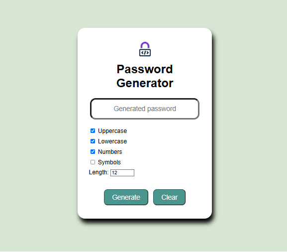

# Random Password Generator
A simple and customizable **Password generator** built with HTML, CSS and JavaScript
## Features
- Generates random and secure passwords
- Clears the generated password by clicking Clear button
- Options include:
  - Uppercase letter
  - Lowercase letters
  - Numbers
  - Symbols
  - Adjustable password length
### Website looks like

## Hosted using Render
- Link to site - https://password-generator-t1di.onrender.com
## How to Use
Clone or download this repository:
```bash
git clone
https://github.com/Vinaya-Busam/Password-Generator.git
```
